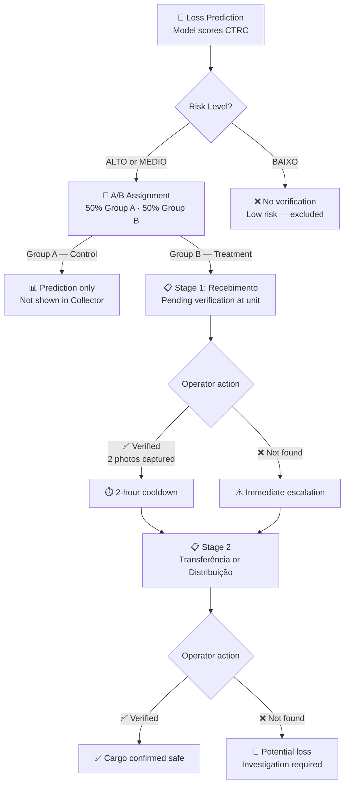
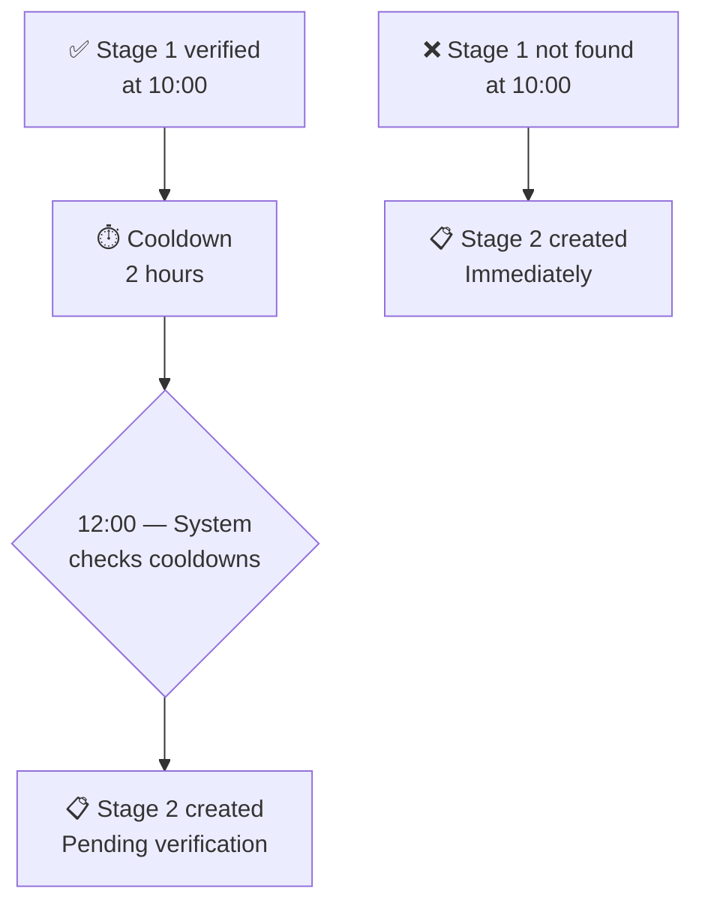
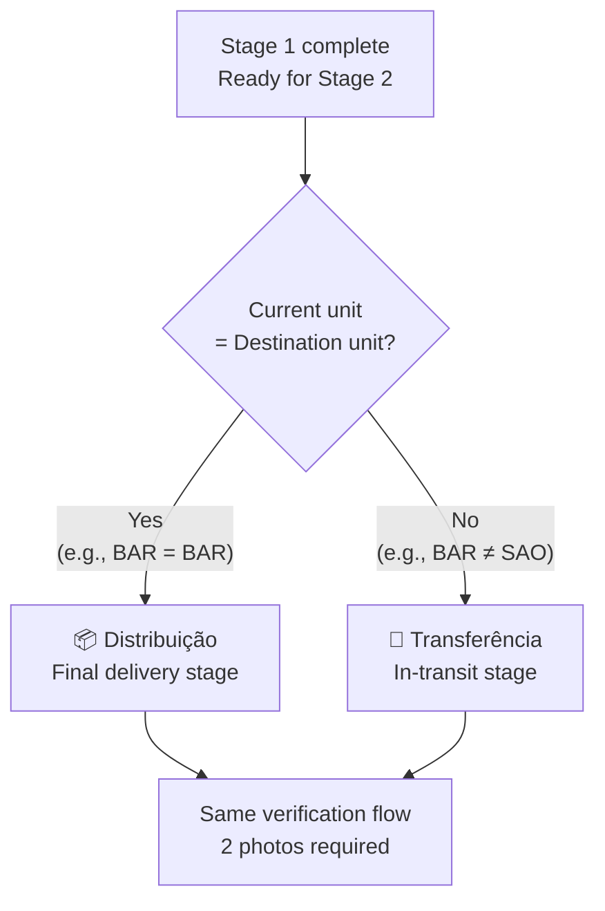
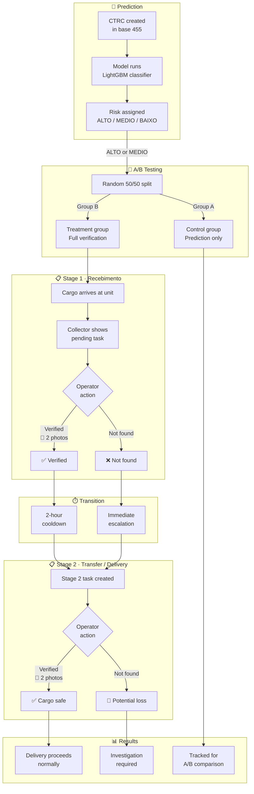

# Recommended Verification Process

The Loss Prediction module identifies CTRCs with high probability of cargo loss **before it happens**. To act on these predictions, the platform implements a **two-stage verification process** that tracks cargo at each logistics checkpoint.

This page describes the full operational flow — how verifications are created, what field operators need to do, and how the system tracks results.

<Callout type="info">
Only CTRCs classified as **ALTO** (high) or **MEDIO** (medium) risk enter the verification workflow. Low-risk CTRCs (BAIXO) are excluded to keep operators focused on actionable items.
</Callout>

---

## How it works — Overview

The verification process has two stages that follow cargo through the logistics network:

<Callout type="tip">
Click the expand button (top-right corner of the diagram) to view it in fullscreen.
</Callout>

---

## Stage 1 — Recebimento (Receiving)

When a CTRC arrives at a logistics unit, the system automatically creates a **verification task** for field operators.

### What the operator sees

In the **Collector** app, the operator selects their unit and sees a list of pending CTRCs sorted by risk (highest probability first). Each item shows:

- CTRC number and risk badge (ALTO in red, MEDIO in yellow)
- Loss probability percentage
- Client, origin, destination
- Cargo value and volume count
- Time since arrival

### What the operator does

<Steps>
<Step title="Find the cargo">
Locate the physical cargo at the unit using the CTRC number displayed in the Collector.
</Step>
<Step title="Photograph the label (etiqueta)">
Take a photo of the cargo's barcode, label, or shipping document. This confirms the specific CTRC was physically found.
</Step>
<Step title="Photograph the location">
Take a second photo showing the cargo's location context — the warehouse area, storage position, or dock. This confirms the operator visually inspected the actual location.
</Step>
<Step title="Submit verification">
The app uploads both photos and marks the CTRC as **verified** at this stage. A 2-hour cooldown timer starts automatically.
</Step>
</Steps>

### If the cargo is not found

If the operator cannot locate the cargo at the unit, they tap **"Not Found"**. This:

1. Marks the current stage as `not_found`
2. **Immediately** creates a Stage 2 verification task (no 2-hour wait)
3. Signals that the cargo was expected but is missing — requiring follow-up

---

## The 2-Hour Cooldown

After a successful Stage 1 verification, the system waits **2 hours** before creating the Stage 2 task.

**Why 2 hours?** In logistics operations, cargo takes time to move through a unit — unloading, processing, sorting, loading. The cooldown gives operators enough time to handle the cargo in receiving before the next checkpoint is triggered.

<Callout type="warning">
If cargo is marked as **not found**, the cooldown is bypassed entirely. Stage 2 is created immediately because the situation requires urgent follow-up.
</Callout>

---

## Stage 2 — Transferência or Distribuição

After the cooldown (or immediately if not found), the system creates a second verification task. The stage type depends on **where the cargo is** relative to its final destination:

| Condition | Stage | Meaning |
|-----------|-------|---------|
| Current unit **≠** destination unit | **Transferência** | Cargo is at an intermediate hub, still in transit |
| Current unit **=** destination unit | **Distribuição** | Cargo reached its final destination |

### Stage detection logic

### Verification at Stage 2

The operator follows the **same process** as Stage 1:

1. Find the cargo at the unit
2. Photograph the label (etiqueta)
3. Photograph the location
4. Submit — or mark as "Not Found"

### Outcomes

- **Verified at Distribuição** → Cargo confirmed safe at final destination. Delivery can proceed.
- **Not Found at Distribuição** → **Potential cargo loss**. The item reached its destination unit but cannot be located. An investigation should be initiated.
- **Verified at Transferência** → Cargo confirmed at intermediate hub. It will continue through the network.
- **Not Found at Transferência** → Cargo missing at intermediate point. Follow-up required.

---

## Complete Operational Flow

The diagram below shows the full end-to-end process, from prediction to resolution:

---

## Why Two Photos?

Every verification requires exactly two photos. Each serves a distinct purpose:

| Photo | What to capture | Why it matters |
|-------|----------------|----------------|
| **Etiqueta** (label) | Barcode, label, or shipping document of the specific CTRC | Proves the cargo was physically found — prevents false positive verifications |
| **Location** (scene) | Warehouse environment, storage area, dock, or equipment | Proves the operator inspected the actual location — prevents lazy or rushed verifications |

<Callout type="info">
Both photos are mandatory. The system will not accept a verification without both the label and location photos.
</Callout>

---

## A/B Testing

To measure the real impact of field verification on loss prevention, the system runs a controlled experiment:

| Group | Assignment | Experience | Purpose |
|-------|-----------|------------|---------|
| **A** (Control) | 50% of ALTO + MEDIO CTRCs | Prediction generated, but **not shown** in Collector | Baseline — what happens without verification |
| **B** (Treatment) | 50% of ALTO + MEDIO CTRCs | Full verification workflow with photo capture | Treatment — what happens with active verification |

### How it works

- Assignment is **random** at prediction time (50/50 split)
- Group A CTRCs are **never shown** to field operators — they don't know these items exist
- Group B CTRCs appear in the Collector with full verification flow
- Both groups are tracked for loss occurrences over time

### What we measure

By comparing outcomes between groups A and B, we can quantify:

- Does active verification **reduce actual cargo losses**?
- What is the **time cost** of verification per CTRC?
- What is the **financial return** of prevented losses vs. operational cost?

<Callout type="tip">
The A/B test runs continuously. Results are analyzed periodically to determine if verification should be expanded to all CTRCs or adjusted for different risk thresholds.
</Callout>

---

## Summary

| Aspect | Detail |
|--------|--------|
| **Who verifies** | Field operators at logistics units, via the Collector app |
| **What is verified** | ALTO and MEDIO risk CTRCs (Group B only) |
| **Stage 1** | Recebimento — when cargo arrives at a unit |
| **Stage 2** | Transferência (in transit) or Distribuição (final destination) |
| **Photos required** | 2 per verification: label (etiqueta) + location |
| **Cooldown** | 2 hours after Stage 1 verified; immediate if not found |
| **A/B testing** | 50/50 random split; Group A = control, Group B = treatment |

<Card title="Collector" href="/v1/platform/collector">
Learn how field operators use the Collector app to perform verifications.
</Card>

<Card title="Loss Prediction Table" href="/v1/platform/loss-prediction/table">
View all scored CTRCs with risk badges and probability bars.
</Card>
