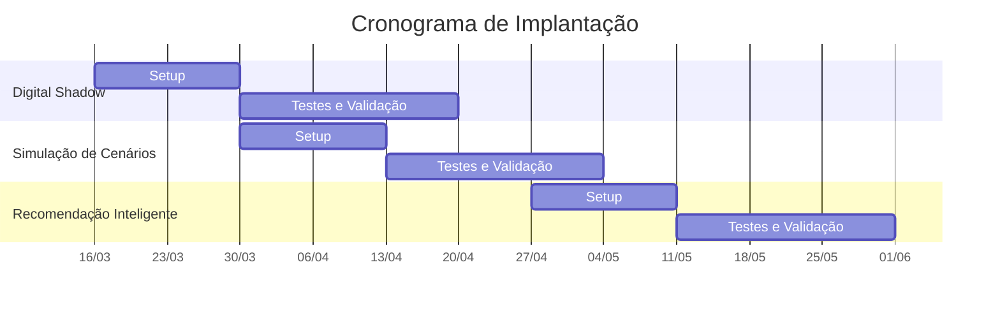

# Onboarding

A implantação do Laplace Log na sua operação acontece em três estágios progressivos. Cada estágio entrega valor imediato e funciona de forma independente — você já opera com o que foi entregue enquanto o próximo estágio está sendo preparado.

---

## Cronograma de Implantação

| Estágio | Fase | Início | Término | Duração |
|---------|------|--------|---------|---------|
| Digital Shadow | Setup | 23/03 | 30/03 | 2 semana |
| | Testes e Validação | 31/03 | 20/04 | 3 semanas |
| Simulação de Cenários | Setup | 21/04 | 27/04 | 2 semana |
| | Testes e Validação | 28/04 | 25/05 | 3 semanas |
| Recomendação Inteligente | Setup | 26/05 | 01/06 | 23 semana |
| | Testes e Validação | 02/06 | 29/06 | 3 semanas |

---

## Checklist por Estágio

Cada estágio segue o mesmo ritmo em duas fases:

- **Setup** — Integração, configuração e parametrização inicial da plataforma para o estágio em questão.
- **Testes e Validação** — Ciclos iterativos de teste com a equipe operacional, ajustando o sistema até atingir aderência à operação real.

### Estágio 1 · Digital Shadow

**Setup** *(semana 1-2)*
- [ ] Cadastro da malha: unidades, rotas e veículos
- [ ] Sincronização do Modelo Digital em tempo real com bases disponíveis
- [ ] Configuração da visualização do modelo na plataforma

**Testes e Validação** *(semanas 3–5)*
- [ ] Apresentação e iteração com a Torre de Tráfego
- [ ] Sincronização do Modelo Digital em tempo real com bases restantes 
- [ ] Validação do funcionamento com a equipe operacional

### Estágio 2 · Simulação de Cenários

**Setup** *(semanas 1-2)*
- [ ] Definição das rotas e cenários prioritários
- [ ] Configuração do comparador de rotas (custo, prazo, SLA)

**Testes e Validação** *(semanas 3–5)*
- [ ] Apresentação e iteração com a Torre de Tráfego
- [ ] Adaptações das restrições do modelo às especificidades da operação
- [ ] Ajustes na modelagem da malha
- [ ] Validação do funcionamento com a equipe operacional

### Estágio 3 · Recomendação Inteligente

**Setup** *(semanas 1-2)*
- [ ] Configuração do motor de recomendação
- [ ] Adaptações das recomendações às especificidades da operação

**Testes e Validação** *(semanas 3-5)*
- [ ] Apresentação e iteração com a Torre de Tráfego
- [ ] Validação do funcionamento com a equipe operacional
- [ ] Comparação das sugestões do sistema contra decisões históricas

---

## O que acontece em cada estágio

### Estágio 1 · Digital Shadow

**O sistema enxerga. O operador decide.**

Hoje, a informação da sua malha logística está espalhada entre o TMS, planilhas e a experiência do dia a dia. No primeiro estágio, conectamos a plataforma ao seu TMS e consolidamos tudo em uma única visão.

No **Setup**, cadastramos a malha completa — unidades, rotas e veículos — e sincronizamos o modelo digital em tempo real com as bases disponíveis. Em **Testes e Validação**, apresentamos a plataforma à Torre de Tráfego, sincronizamos as bases restantes e iteramos até que o painel reflita a operação real com fidelidade.

Ao final desta etapa, sua equipe acessa um painel com o mapa completo da rede de transferências: onde cada carga está, qual o status de cada trecho e quais prazos estão em risco.

**O que sua operação ganha:**

- Ocupação das unidades e rotas dos veículos visíveis em tempo real
- Toda a malha logística representada em um só lugar
- Base de dados unificada que serve de fundação para os estágios seguintes

**Duração estimada:** 4 semanas a partir da kickoff.

---

### Estágio 2 · Simulação de Cenários

**O operador pergunta. O sistema responde.**

Com a visibilidade resolvida, o próximo passo é permitir que sua equipe teste alternativas antes de executá-las.

No **Setup**, definimos junto com sua equipe quais rotas e cenários são prioritários e configuramos o comparador de rotas (custo, prazo, SLA). Em **Testes e Validação**, apresentamos à Torre de Tráfego, adaptamos as restrições do modelo às especificidades da operação, ajustamos a modelagem da malha e iteramos até que as projeções estejam aderentes à realidade operacional.

O simulador compara opções de rota — por exemplo, enviar direto de A→C ou consolidar via A→B→C — considerando custo de frete, tempo de trânsito e nível de serviço.

**O que sua operação ganha:**

- Decisões de rota fundamentadas em dados, não em intuição
- Capacidade de justificar escolhas com números concretos
- Redução de erros de planejamento porque o cenário foi testado antes

**Duração estimada:** 5 semanas após a conclusão do Digital Shadow.

---

### Estágio 3 · Recomendação Inteligente

**O sistema sugere. O operador aprova.**

A iniciativa muda de lado. Em vez de esperar a pergunta do operador, o sistema passa a avaliar cenários automaticamente e apresenta a melhor opção já calculada.

No **Setup**, configuramos o motor de recomendação e adaptamos as sugestões às especificidades da operação. Em **Testes e Validação**, apresentamos à Torre de Tráfego, comparamos as sugestões do sistema contra decisões históricas e iteramos até que as recomendações sejam confiáveis.

Múltiplas estratégias são avaliadas em paralelo — custo, prazo, ocupação de veículo — e entregues como recomendação ranqueada. O operador revisa, ajusta se necessário e aprova. Nenhuma decisão é executada sem validação humana.

**O que sua operação ganha:**

- A equipe deixa de escolher quais cenários testar — o sistema já testou
- Mais tempo para exceções e decisões estratégicas
- Otimização contínua com base no histórico real da sua operação

**Duração estimada:** 5 semanas após a conclusão da Simulação de Cenários.

---

*Cada estágio é entregue, validado e operacional antes do início do próximo. O cronograma é ajustado em conjunto conforme a complexidade da sua malha e a disponibilidade da equipe.*
