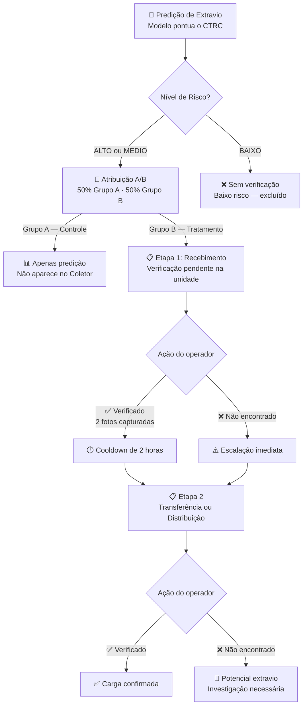
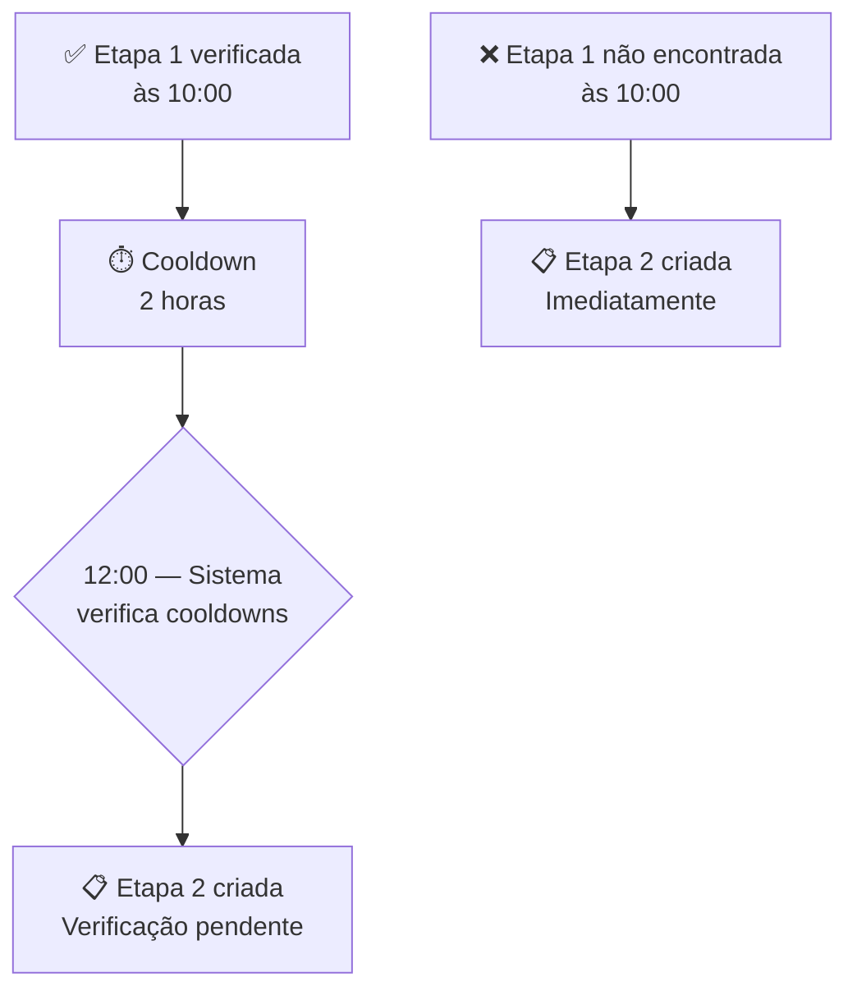
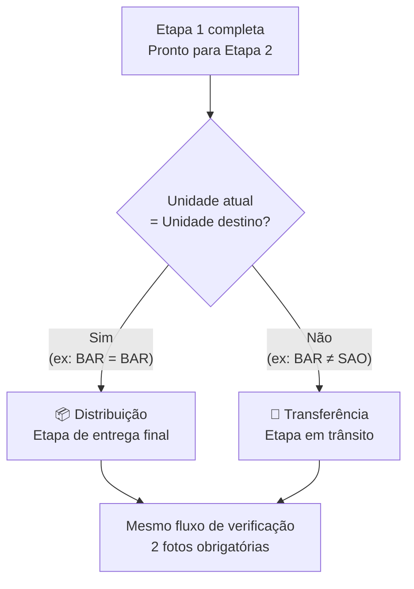
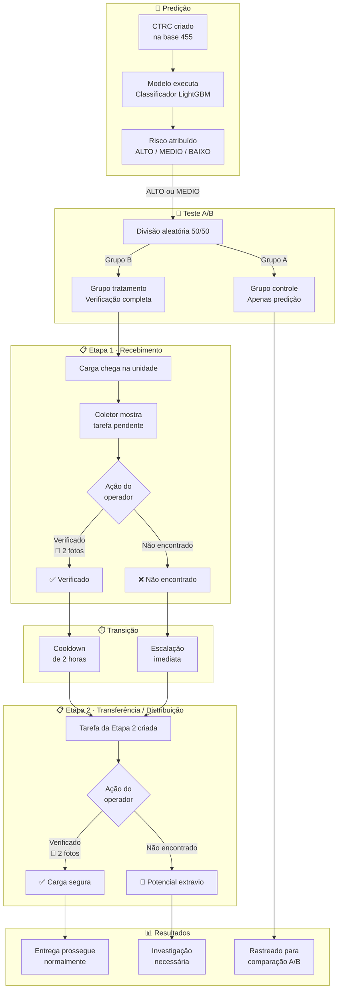

# Processo Recomendado de Verificação

O módulo de Predição de Extravios identifica CTRCs com alta probabilidade de perda de carga **antes que ela aconteça**. Para agir sobre essas predições, a plataforma implementa um **processo de verificação em duas etapas** que rastreia a carga em cada ponto de controle logístico.

Esta página descreve o fluxo operacional completo — como as verificações são criadas, o que os operadores de campo precisam fazer e como o sistema acompanha os resultados.

<Callout type="info">
Apenas CTRCs classificados como **ALTO** ou **MEDIO** risco entram no fluxo de verificação. CTRCs de baixo risco (BAIXO) são excluídos para manter os operadores focados nos itens que realmente precisam de atenção.
</Callout>

---

## Como funciona — Visão Geral

O processo de verificação possui duas etapas que acompanham a carga pela malha logística:

<Callout type="tip">
Clique no botão de expandir (canto superior direito do diagrama) para visualizar em tela cheia.
</Callout>

---

## Etapa 1 — Recebimento

Quando um CTRC chega a uma unidade logística, o sistema cria automaticamente uma **tarefa de verificação** para os operadores de campo.

### O que o operador vê

No aplicativo **Coletor**, o operador seleciona sua unidade e vê a lista de CTRCs pendentes, ordenados por risco (maior probabilidade primeiro). Cada item mostra:

- Número do CTRC e badge de risco (ALTO em vermelho, MEDIO em amarelo)
- Percentual de probabilidade de extravio
- Cliente, origem, destino
- Valor da mercadoria e quantidade de volumes
- Tempo desde a chegada

### O que o operador faz

<Steps>
<Step title="Localizar a carga">
Encontrar a carga física na unidade usando o número do CTRC exibido no Coletor.
</Step>
<Step title="Fotografar a etiqueta">
Tirar uma foto do código de barras, etiqueta ou documento de embarque da carga. Isso confirma que o CTRC específico foi encontrado fisicamente.
</Step>
<Step title="Fotografar a localização">
Tirar uma segunda foto mostrando o contexto da localização — área do armazém, posição de armazenamento ou doca. Isso confirma que o operador inspecionou visualmente o local.
</Step>
<Step title="Enviar a verificação">
O aplicativo faz upload das duas fotos e marca o CTRC como **verificado** nesta etapa. Um timer de cooldown de 2 horas inicia automaticamente.
</Step>
</Steps>

### Se a carga não for encontrada

Se o operador não conseguir localizar a carga na unidade, ele toca em **"Não Encontrado"**. Isso:

1. Marca a etapa atual como `não encontrada`
2. Cria **imediatamente** uma tarefa de verificação da Etapa 2 (sem esperar 2 horas)
3. Sinaliza que a carga era esperada mas não está presente — requer acompanhamento

---

## O Cooldown de 2 Horas

Após uma verificação bem-sucedida na Etapa 1, o sistema aguarda **2 horas** antes de criar a tarefa da Etapa 2.

**Por que 2 horas?** Na operação logística, a carga leva tempo para se mover dentro de uma unidade — descarga, processamento, triagem, carregamento. O cooldown dá aos operadores tempo suficiente para manusear a carga no recebimento antes que o próximo ponto de verificação seja acionado.

<Callout type="warning">
Se a carga for marcada como **não encontrada**, o cooldown é ignorado completamente. A Etapa 2 é criada imediatamente porque a situação requer acompanhamento urgente.
</Callout>

---

## Etapa 2 — Transferência ou Distribuição

Após o cooldown (ou imediatamente se não encontrada), o sistema cria uma segunda tarefa de verificação. O tipo da etapa depende de **onde a carga está** em relação ao seu destino final:

| Condição | Etapa | Significado |
|----------|-------|-------------|
| Unidade atual **≠** unidade destino | **Transferência** | Carga está em um hub intermediário, ainda em trânsito |
| Unidade atual **=** unidade destino | **Distribuição** | Carga chegou ao seu destino final |

### Lógica de detecção da etapa

### Verificação na Etapa 2

O operador segue o **mesmo processo** da Etapa 1:

1. Localizar a carga na unidade
2. Fotografar a etiqueta
3. Fotografar a localização
4. Enviar — ou marcar como "Não Encontrado"

### Resultados

- **Verificado na Distribuição** → Carga confirmada no destino final. A entrega pode prosseguir.
- **Não Encontrado na Distribuição** → **Potencial extravio de carga**. O item chegou à unidade de destino mas não pode ser localizado. Uma investigação deve ser iniciada.
- **Verificado na Transferência** → Carga confirmada no hub intermediário. Continuará pela malha.
- **Não Encontrado na Transferência** → Carga ausente no ponto intermediário. Acompanhamento necessário.

---

## Fluxo Operacional Completo

O diagrama abaixo mostra o processo completo de ponta a ponta, da predição à resolução:

---

## Por Que Duas Fotos?

Toda verificação exige exatamente duas fotos. Cada uma tem um propósito distinto:

| Foto | O que capturar | Por que importa |
|------|---------------|-----------------|
| **Etiqueta** | Código de barras, etiqueta ou documento de embarque do CTRC específico | Prova que a carga foi encontrada fisicamente — previne verificações falso-positivas |
| **Localização** (cena) | Ambiente do armazém, área de armazenamento, doca ou equipamento | Prova que o operador inspecionou o local real — previne verificações apressadas ou negligentes |

<Callout type="info">
As duas fotos são obrigatórias. O sistema não aceita uma verificação sem ambas as fotos — etiqueta e localização.
</Callout>

---

## Teste A/B

Para medir o impacto real da verificação de campo na prevenção de extravios, o sistema executa um experimento controlado:

| Grupo | Atribuição | Experiência | Propósito |
|-------|-----------|-------------|-----------|
| **A** (Controle) | 50% dos CTRCs ALTO + MEDIO | Predição gerada, mas **não exibida** no Coletor | Baseline — o que acontece sem verificação |
| **B** (Tratamento) | 50% dos CTRCs ALTO + MEDIO | Fluxo completo de verificação com captura de fotos | Tratamento — o que acontece com verificação ativa |

### Como funciona

- A atribuição é **aleatória** no momento da predição (divisão 50/50)
- CTRCs do Grupo A **nunca são exibidos** aos operadores de campo — eles não sabem que esses itens existem
- CTRCs do Grupo B aparecem no Coletor com o fluxo completo de verificação
- Ambos os grupos são rastreados para ocorrências de extravio ao longo do tempo

### O que medimos

Ao comparar os resultados entre os grupos A e B, conseguimos quantificar:

- A verificação ativa **reduz os extravios reais de carga**?
- Qual é o **custo operacional** da verificação por CTRC?
- Qual é o **retorno financeiro** dos extravios prevenidos vs. custo operacional?

<Callout type="tip">
O teste A/B roda continuamente. Os resultados são analisados periodicamente para determinar se a verificação deve ser expandida para todos os CTRCs ou ajustada para diferentes faixas de risco.
</Callout>

---

## Resumo

| Aspecto | Detalhe |
|---------|---------|
| **Quem verifica** | Operadores de campo nas unidades logísticas, via app Coletor |
| **O que é verificado** | CTRCs ALTO e MEDIO risco (apenas Grupo B) |
| **Etapa 1** | Recebimento — quando a carga chega à unidade |
| **Etapa 2** | Transferência (em trânsito) ou Distribuição (destino final) |
| **Fotos obrigatórias** | 2 por verificação: etiqueta + localização |
| **Cooldown** | 2 horas após Etapa 1 verificada; imediato se não encontrada |
| **Teste A/B** | Divisão aleatória 50/50; Grupo A = controle, Grupo B = tratamento |

<Card title="Coletor" href="/v1/platform/collector">
Saiba como os operadores de campo usam o app Coletor para realizar verificações.
</Card>

<Card title="Tabela de Predição de Extravios" href="/v1/platform/loss-prediction/table">
Veja todos os CTRCs pontuados com badges de risco e barras de probabilidade.
</Card>
